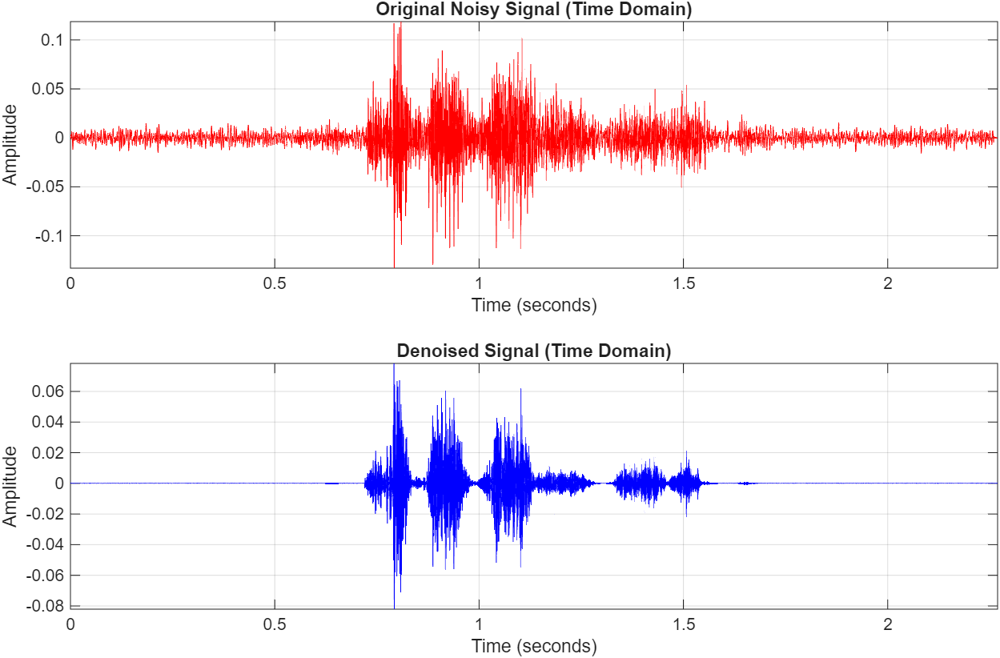
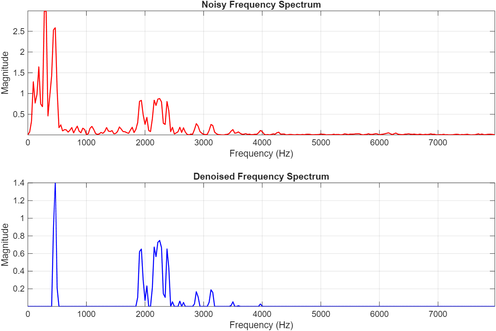
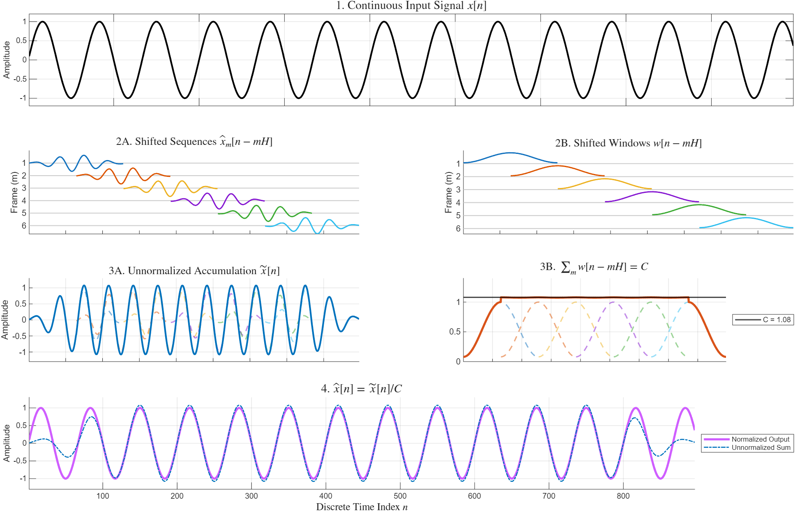

# audio denoising via matlab using custom fft and ifft (mt1007-apr2026-sem252)


honestly just trying to survive this linear algebra project. made the fourier from-scratch without using `fft` or `ifft`. visualizations are for report.

---

## outline

### fourier.m
* **custom radix-2 fft:** achieve $O(N \log_2 N)$ efficiency, because the standard $N^2$ dft is very slow.
* **ifft:** uses the complex conjugate property to flip the spectrum back into the time domain.
* **manual hamming windowing:** tapers the frame boundaries to suppress the specxtral leakage.
* **overlap-add synthesis:** 50% overlapping hop size, so $H = L/2$.
* **magnitude thresholding:** used an over-subtraction factor $\alpha = 5.0$ and a spectral floor $\beta = 0.01$.

### hamming_window.m
* visualize hamming window concept for report part 3.3.1

### gainmask.m
* visualize gain computation and function properties behaviour for report part 3.3.2

### ola.m
* visualize the reason behind the overlap-add method and final normalizing step for report part 3.3.3

---

## visual results

heres how it looks. (all input and output data can be accesed through /data/##/)

### time-domain
*top is the input audio. bottom is after the custom ifft put the pieces back together. (output from noisy_audio_test1.wav)*



### frequency-domain
*plotted up to the nyquist frequency. the hamming window stops the bleeding -> high magnitudes survive. (output from noisy_audio_test1.wav)*



### other samples
*these are the outputs from .wav files in folders 03, 04, 06 and 10, in top-down order.*


## ! notice !
**the visualizations from this point onwards are for illustration purposes and werent sampled with real audio files. they are developed based on code segments provided in 'signals and systems for bioengineers - a matlab-bsed introduction' by j. l. semmlow**

### hamming window visualization
*graphed to help with understanding of the implementation of hamming window in the fourier.m file.*


### gain function visualization
*graphed to help with understanding of properties in gain function introduced by tripathi and what its properties doing.*


### overlap-add math visualization
*graphed to help with understanding of the underlying math of ola method and the reason for normalizing using cola sum.*



---

## usage

1.  **clone repo:**
    ```bash
    git clone [https://github.com/nrfdltr/fft-audio-denoising.git](https://github.com/nrfdltr/fft-audio-denoising.git)
    ```
2.  **run the script:** open matlab and run script
3.  have fun i go sleep now zzzzzZZz

---

## references
* **audio data:** from rajat borkar on kaggle. 

* **math:** tripathi et al. (2024) for denoise pipeline (hamming, mag threshold, cola),

    harris (1978) for hamming,

    mota (2022) for dft/fft, 

    wen (2025) for ifft, 

    brunton (2022) for complex conjugate theory,

    semmlow (2012) for the visuals matlab code.

* **implementation:** followed the classical denoising pipeline introduced by tripathi et al. '*quantum fourier transform–based denoising*' to implement into matlab code fourier.m.
